# mpdb

Maya Python Debugger for TD & TA

[en_US](./README.md) | [zh_CN](./README_zh_CN.md)

## Insatall 

I using a module installer method to install mpdb plugin, which you could check [here](https://github.com/robertjoosten/maya-module-installer)   
All you need to do is pretty simple, follow the step below.
1. download the release version of the plugin. (you also can clone the release branch)
2. unzip the folder to any location in your computer.(skip this step if you clone the branch)
3. drag the mpdb.mel to your running Maya viewport.

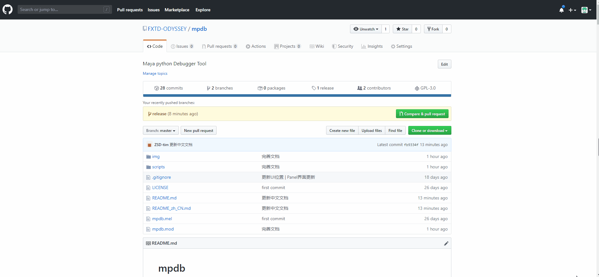

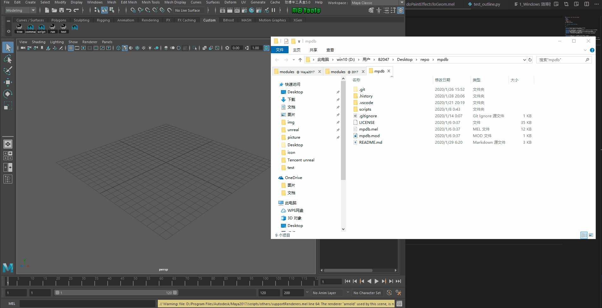

When you run the mel script once, the plugin will load every time you open Maya.    
You can use the [module manager](https://github.com/robertjoosten/maya-module-manager) to manage the plugin mod information.   

## Description

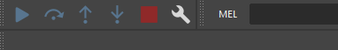

All the Icon have toolTip and statusTip tell you how to use it.

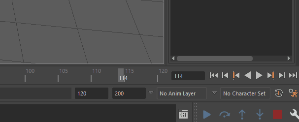

Middle Click Script Editor Icon can popup up the debug toolbar on the right side.

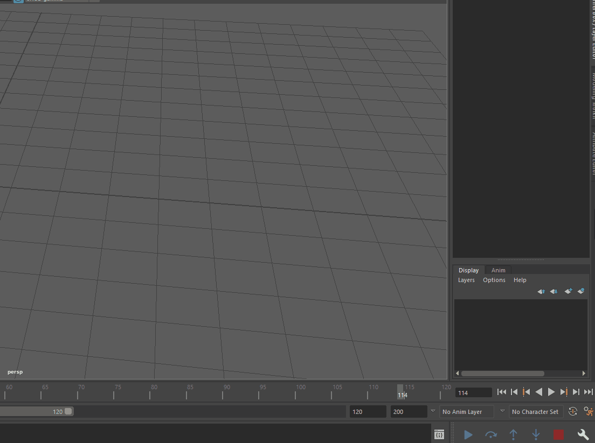

Click the setting icon can show up the Debugger Panel window.

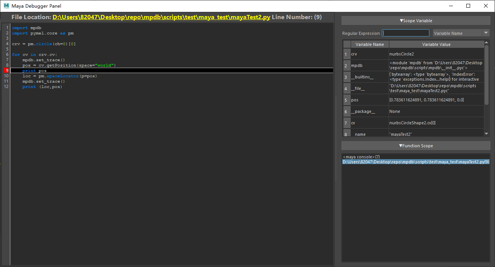

When you hit the breakpoint.     
Debugger Panel will display debugger information for the current running python file.      
CodeEditor on the right and the Scope Information on the left.     

## How to set breakpoint

the plugin fully base on the pdb module , you could think it as the pdb module wrap for maya and interact with Qt Widget.

```python
import mpdb
mpdb.set_trace()
```

Once the debug toolbar popup, you can import the mpdb module already.     
And how it work is exactly the same as python pdb module.

When you use the set_trace method, the next running line will set breakpoint.

## Debug example 1

```Python
import mpdb

def add(a,b):
    print (a,b)
    return a+b

def mul(a,b):
    print (a,b)
    return a*b

def main():
    mpdb.set_trace()
    a = 1
    b = 2

    c = add(a,b)

    mpdb.set_trace()
    d = mul(c,b)

    print (a,b,c,d)
    return a,b,c,d

if __name__ == "__main__":
    mpdb.set_trace()
    main()
    print "done"
```

this is the code how I test the mpdb plugin.    
you can paste the code and run in the Script Editor Directly or you can load it as the module and import it.

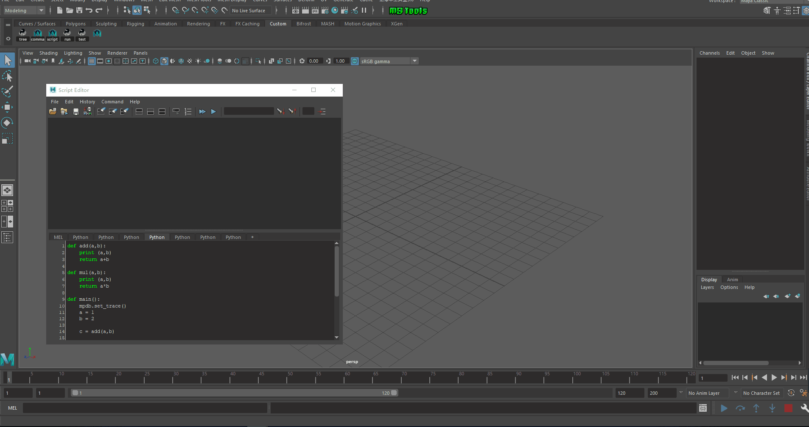

If you run in the Script Editor directly, Plugin cannot find the code snippet inside maya,but you still could trace the variable and scope changed.

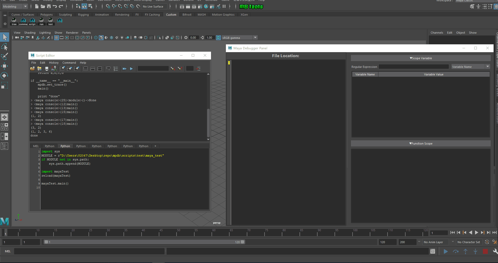

If you import the code,then it can trace the file content and show the code snippet on the left.

## Debug example 2

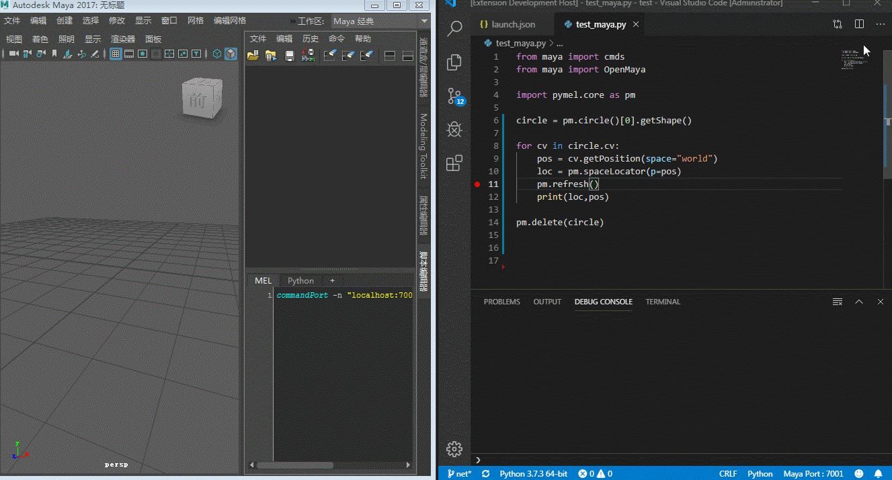

this is the example I test for the mayapy vsocde extension
when you debug code outside Maya that the debugger would freeze maya and maya no longer response to you .

```Python
import mpdb
import pymel.core as pm

crv = pm.circle(ch=0)[0]

for cv in crv.cv:
    pos = cv.getPosition(space="world")
    loc = pm.spaceLocator(p=pos)
    mpdb.set_trace()
    print (loc,pos)
```
this is a little modified version for mpdb module.

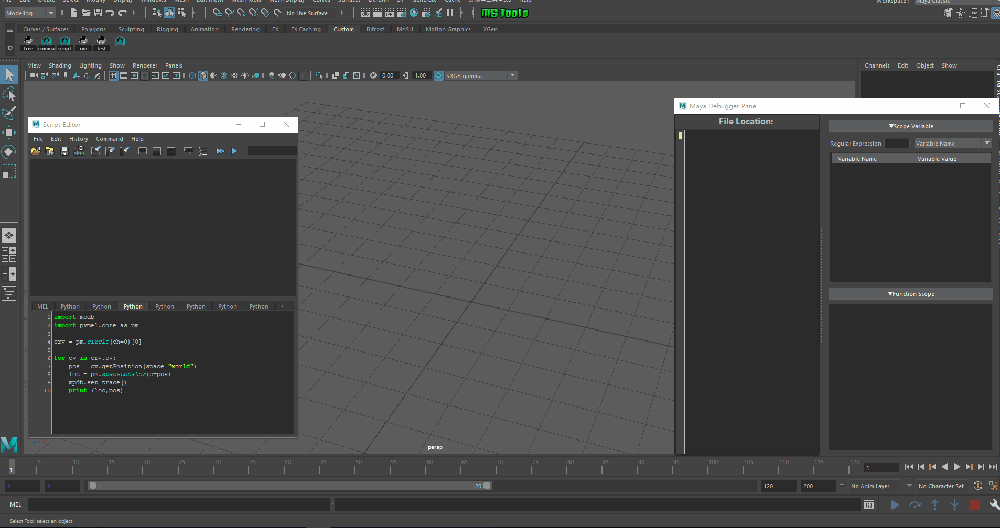

mpdb Module Debugger keep maya alive on the run time , awesome!~

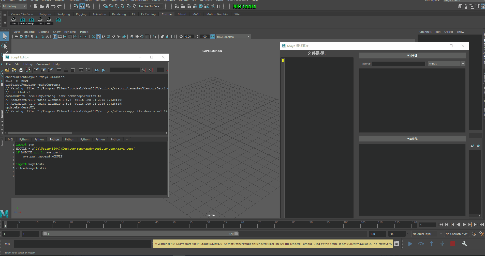

And you also can modify the variable data on the run time

## Stop Button Feature


Stop Button has two stop debug feature

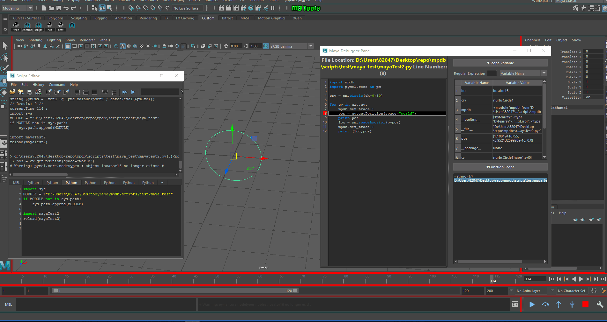

1. Left Mouse Click stop at the running line

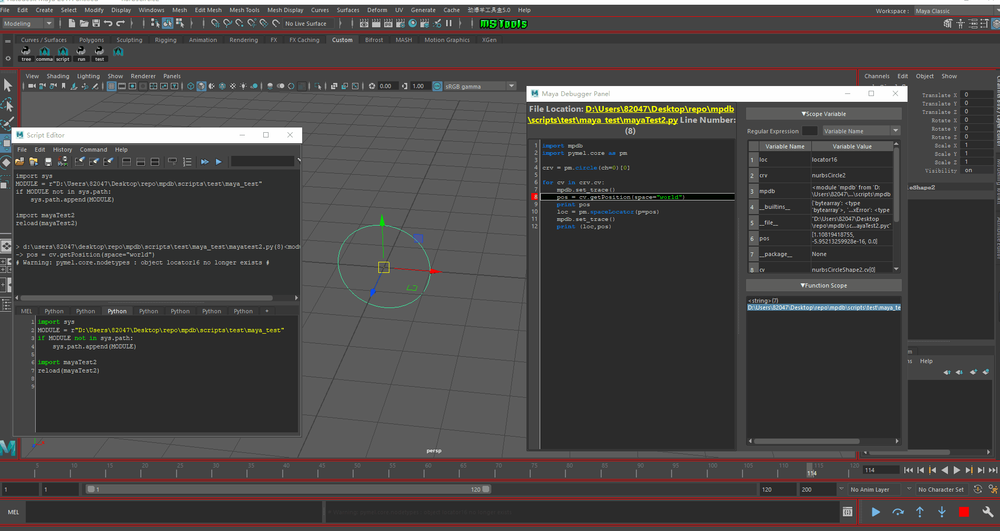

2. Middle Mouse Click ignore all the set_trace breakpoints and keep running

## Setting Button Feature


Setting Button has three feature


1. Left Mouse Click can open the Debugger Panel window.


2. Middle Mouse Click pop up the pdb prompt dialog for pdb input. you can use the pdb command for debugging.

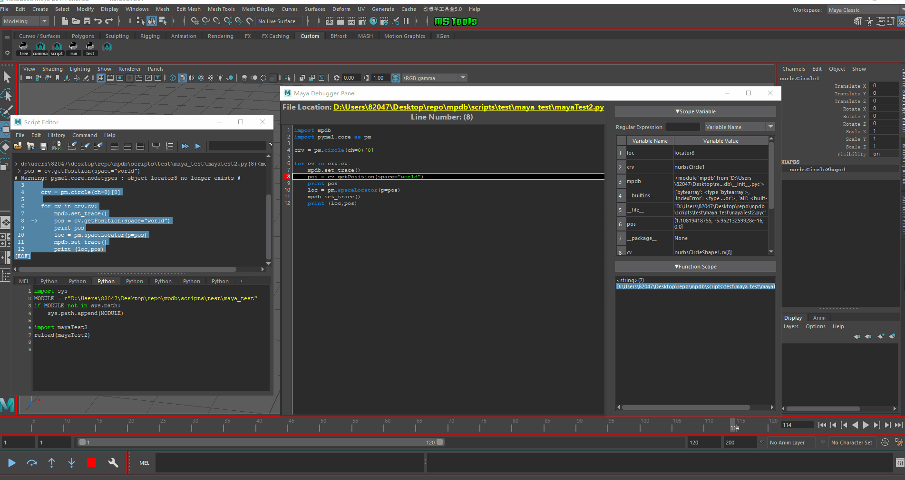

3. Right Mouse Click pop up Language Menu to switch different language mode. (I use the Qt i18n feature that allow the program change the Language on the run time)

## Script Editor Feature

1. Overwrite Execute and ExecuteAll Button

mpdb module overwrite the scriptEditorPanel type to fix some problems    
Maya2017 execute the scriptEditor code and hit the breakpoint will crash the Maya.   
With my effort, I find out that I use the maya.utils.processIdleEvents function to keep maya alive.   
However, Maya 2017 catch the execute event as the idle event and that will crash the maya after debug mode exit \_(:з」∠)_   
So I overwrite the execute button clicked event to fix this problems.   
The overwrite execute function running seamless like the maya original execute method,you probably do not feel it any way.

---

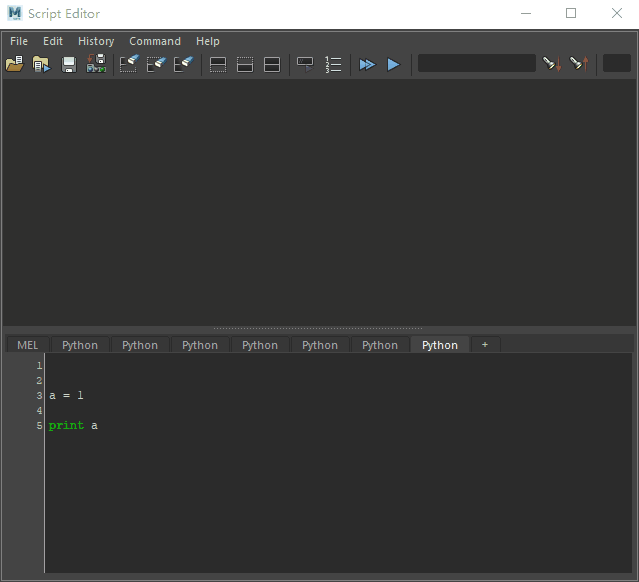

2. Add Ctrl + E shortcut for Execute Button

Sometimes I feel pretty annoying to click the execute button every single time.   
When I write something on the 3ds Max, I can press ctrl + E shrotcut to run the code.   
I think this pretty handy,however maya hotkey editor seem not possible to do that.   
so I use the Qt eventFilter to do this trick,when you focus on the Script Editor Window,then you can press Ctrl + E to run your code. 
